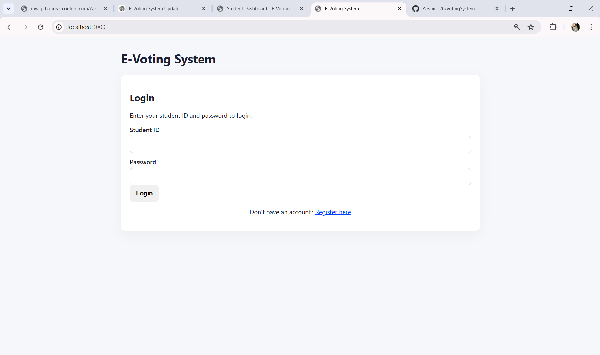
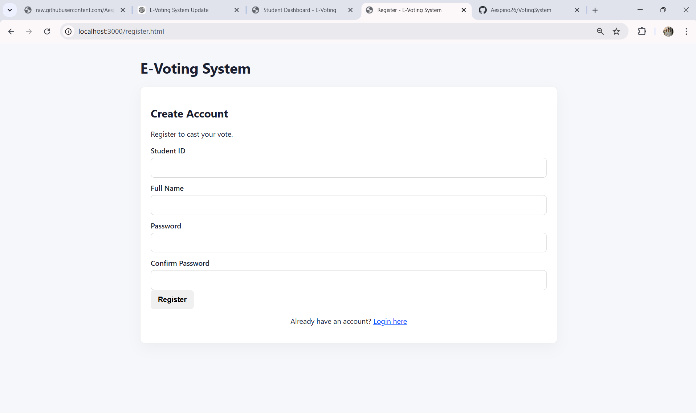
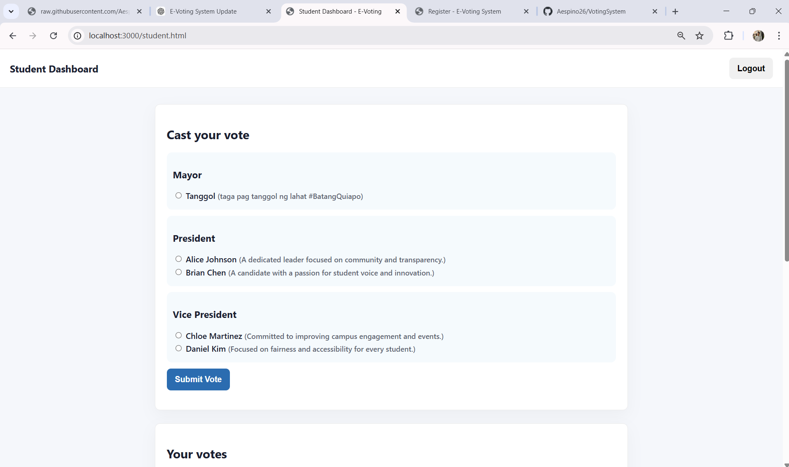
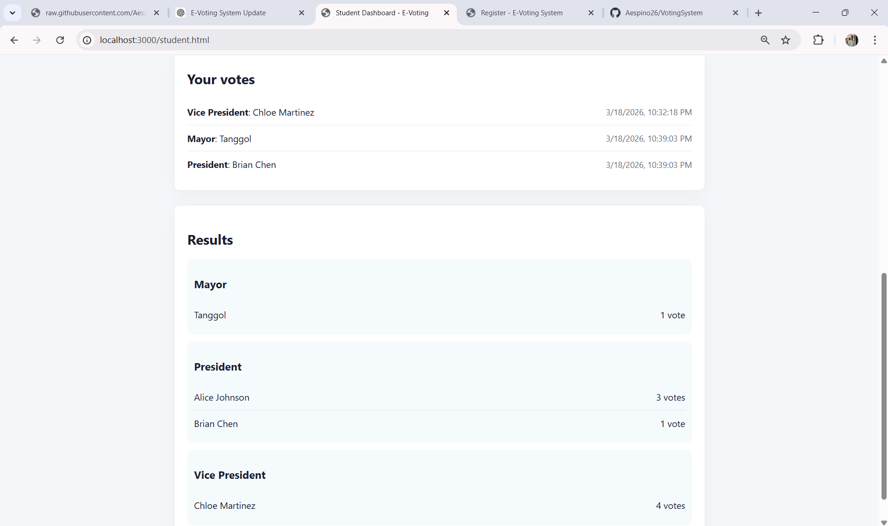
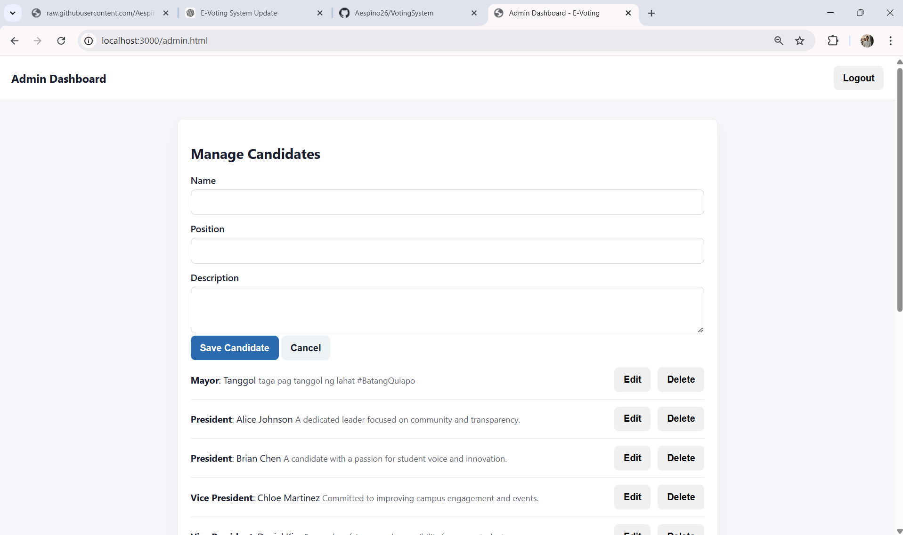
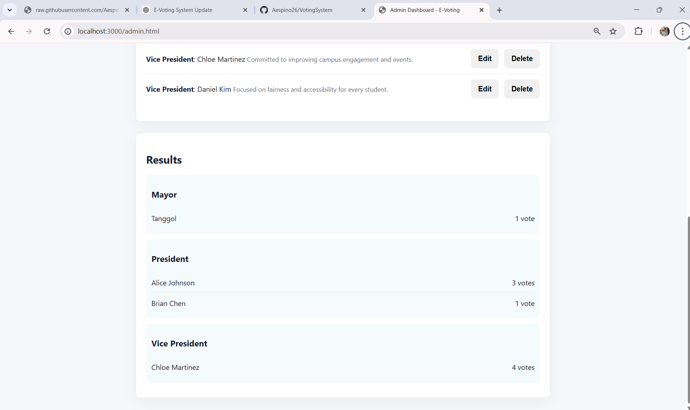

# E‑Voting System

A simple school e‑voting web application built with **NestJS**, **TypeORM**, **SQLite**, and vanilla **HTML/CSS/JS**.

This project provides a small demo of a voting system where students can log in, view candidates, cast votes (once per position), and see results. Admins can manage candidates and view vote totals.

---

## ✅ Features

- Student registration & login
- Admin login
- Candidate browsing (grouped by position)
- One vote per position enforced
- Vote counting and results display
- Admin CRUD for candidates
- Static frontend served from `/public`

---
## Screenshots

- Login page


- Register page


- Student Dashboard



- Admin Dashboard



---
## 🚀 Getting Started

### 1) Install dependencies

```bash
npm install
```

### 2) Run the app

```bash
npm run start:dev
```

Then open:

- http://localhost:3000 (login page)

---

## 🧪 Demo Accounts

- **Admin**
  - Student ID: `admin`
  - Password: `admin`

Students can register via the register page.

---

## 📄 Frontend Pages

| Page | URL |
|------|-----|
| Login | `/` |
| Register | `/register.html` |
| Student Dashboard | `/student.html` |
| Admin Dashboard | `/admin.html` |

---

## 🔌 API Endpoints

| Method | Path | Description |
|--------|------|-------------|
| POST | `/api/auth/register` | Register student |
| POST | `/api/auth/login` | Login (student/admin) |
| GET | `/api/auth/me` | Get current user (requires bearer token) |
| GET | `/api/candidates` | Get candidate list |
| POST | `/api/candidates` | Create candidate (admin only) |
| PUT | `/api/candidates/:id` | Update candidate (admin only) |
| DELETE | `/api/candidates/:id` | Delete candidate (admin only) |
| POST | `/api/votes` | Cast vote (student only) |
| GET | `/api/votes/me` | Fetch student vote history |
| GET | `/api/votes/results` | Get vote results |

---

## 🛠️ Notes

- Data is stored in `data/voting.sqlite` (created automatically).
- Admin privileges are enforced via JWT roles.
- If the server reports `EADDRINUSE`, another process is using port 3000. Stop it or set `PORT`.

---

## 🧩 Scripts

| Command | Description |
|--------|-------------|
| `npm run start` | Run production server |
| `npm run start:dev` | Run dev server (watch mode) |
| `npm run build` | Compile TypeScript to `dist/` |

---

Enjoy! 👋
